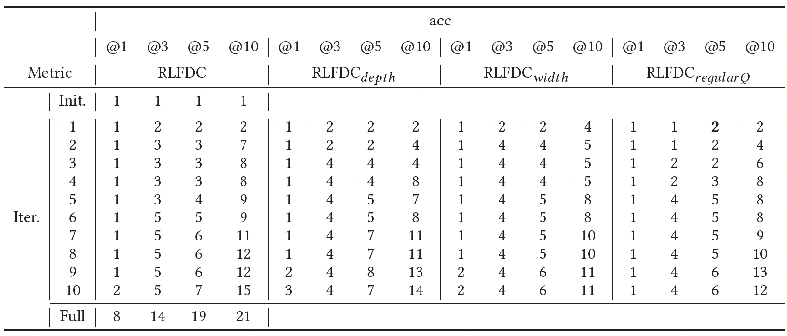

# Ablation study results

We here present the ablation study results for RQ1 on *Time*. 

We include three variants here. For $RLFDC_{depth}$, it means using deeper network (2->3 layers for embedding and 3->4 layers for FDC prediction network). For $RLFDC_{width}$, it means double the width of each layer for the network. For $RLFDC_{regularQ}$, it means using regular Q learning rather than double Q learning for training the network.

From the results, RLFDC is robust to the hyperparamters like the depth and the width of the network structure. Double Q learning indeed helps the network overcome the problem of overestimation and leads to more accurate FDC prediction.

### acc@n values on human-written tests:

