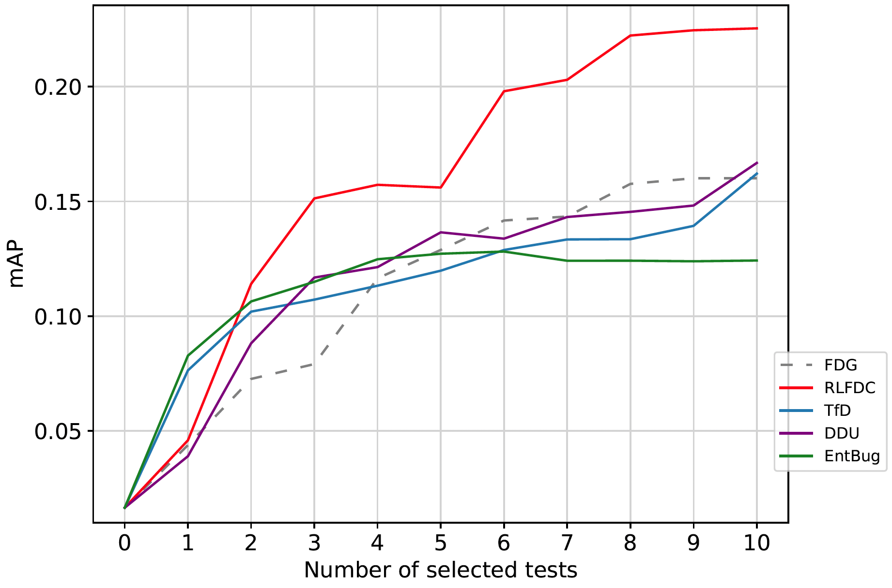

# Results on other subjects

We here present the additional results for RQ1 on another subject from Defects4J, *Mockito*. 

*Mockito* has 38 buggy versions, and we include them all for evaluation.

From the results, RLFDC consistently outperforms other result-agnostic metrics, even outperforms the best result-aware metric FDG in terms of acc@n and mAP. 

### acc@n values on human-written tests:

### mAP values on human-written tests:
